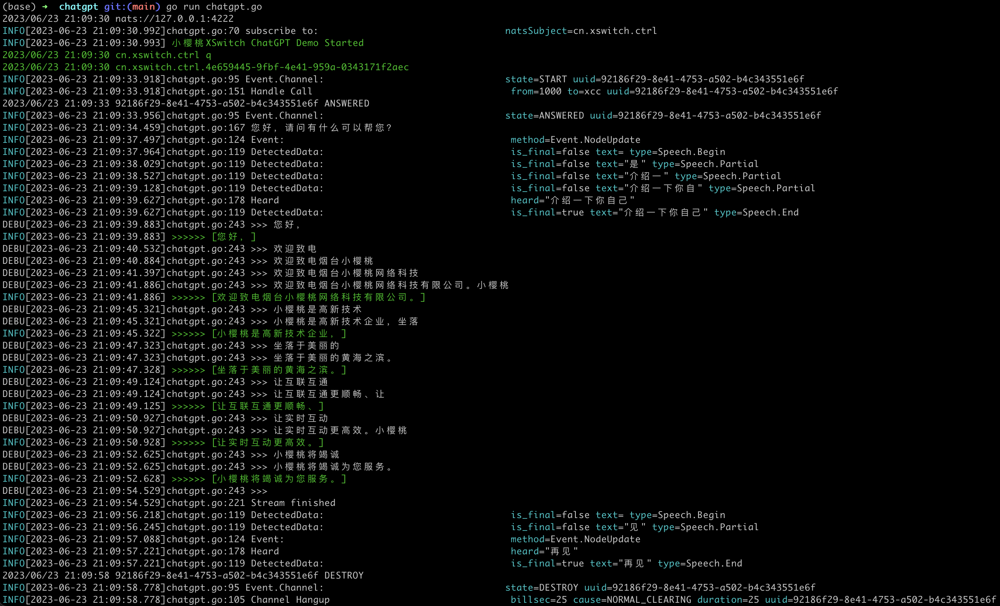

# ChatGPT Demo

Talk to ChatGPT from your phone in 310 lines of Go code. 用310行Go代码写一个完整的ChatGPT语音聊天程序。

## Prerequest

- [XSwitch](https://docs.xswitch.cn/installation/), Community version is free and enough to run this demo.
- One of AI Modules, e.g. mod_ali or mod_baidu, included in XSwitch.
- [XCC API](https://docs.xswitch.cn/xcc-api/) with a [NATS](https://nats.io/) Server.
- [XCtrl](https://git.xswitch.cn/xswitch/xctrl).

If you don't need a web admin you can try [XSwitch without XUI](https://docs.xswitch.cn/howto/xswitch-only/) or use [xswitch-free](https://github.com/rts-cn/xswitch-free) as an alternative.

Alternatively, You can use opensource [FreeSWITCH](https://giithub.com/signalwire/freeswitch) with ESL and one of ASR/TTS modules like [mod_unimrcp](https://github.com/freeswitch/mod_unimrcp).

## Build and Run

```sh
make
make run
```

or

```sh
go run chatgpt.go
```

## Pull Requests

Pull Requests is welcome but the main purpose of this demo is to keep it simple and easy to understand, and strictly limited in "310 lines of code".

## Videos

There's some videos on Wechat: <https://mp.weixin.qq.com/s/cdlkDu3WH6I5X9YWJxG7vA> .

## Todo

This Readme is not complete, come back and check updates if you need more details. A Chinese version will also be available soon.

## Screenshots


